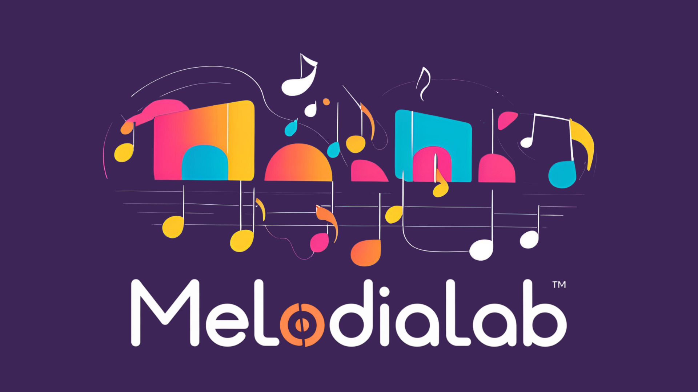

# MelodiaLab 🎶

Plataforma de organização e criação musical, voltada para artistas e músicos que desejam criar, gerenciar e personalizar seus projetos musicais.  

## Tecnologias Utilizadas

- *Backend*: Python com Flask
- *Frontend*: HTML, CSS e JavaScript
- *Banco de Dados*: SQLite3 com Python

## Diagrama de classes

## Como instalar o sistema
### Requisitos 
- Computador
- Internet
- Visual Studio Code
- Python
- Biblioteca flask para Python
- Extensão Python do VS Code
- Git 

### Clonar repositório do Github
1. Abra o Visual Studio Code e clique no botão "Controle de código de fonte"

2. Clique em "Clonar repositório", "Clonar de Github" e Clique em "Permitir" na janela que vai aparecer.

3. Faça o login, autorize o Visual Code e depois "Abrir Link" para abrir novamente o programa.

4. Escolha o repositório do projeto para clonar

5. Deseja abrir o repositório clonado? Abrir

### Instalar a extensão do Python 
1. Clique em "Extensões" no menu a esquerda ou CTRL+SHIFT+X
2. Procure por "Python"
3. Clique em "Instalar"

### Instalar a biblioteca Flask
1. Abrir um novo terminal: Barra de ferramentas > Três pontinhos > Terminal > Novo Terminal

2. No terminal, digite o comando `pip install flask` e pressione enter

### Configurando GIT
1. No terminal digite os comandos: 

`git config user.name seu_usuario`

`git config user.email seu_nome@email.com`

## Como executar o servidor 
1. Clique com o botão direito no arquivo "app.py" e selecione "Executar o arquivo Python no terminal"
